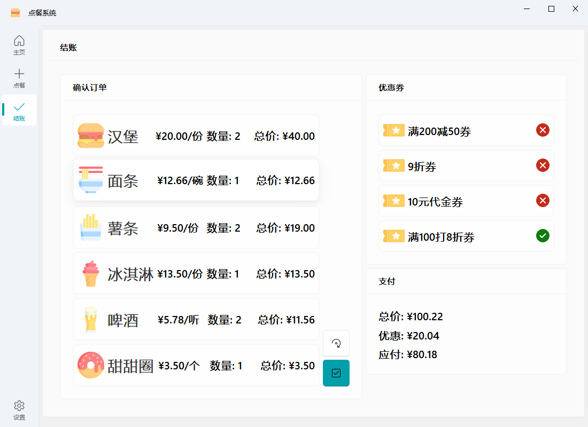

<h1 align="center">orderDishes</h1>

<div align="center">

<p>点餐系统</p>


</div>

## 项目介绍

点餐系统，用户可以选择菜品，生成价格

## 项目技术

- Python
  - PyQt5
  - [QFluentWidgets](https://qfluentwidgets.com/)

## 从代码运行

参见 <https://qfluentwidgets.com/zh/pages/install>

Python 版本最低 `3.7`

**按照此命令安装**

```bash
pip install PyQt-Fluent-Widgets -i https://pypi.org/simple/
```

## 截图



## 项目结构
- [main.py](main.py) 主程序
- 主窗口 [mainWindow.py](mainWindow.py)
  - MainWindow 类: 主窗口类，继承自 MSFluentWindow，负责管理各个子界面的切换和显示。
  - BaseInterface 类: 基础界面类，继承自 ScrollArea，为各个子界面提供统一的布局和样式。
  - HomeInterface 类: 主页界面类，显示应用信息卡片，用户可以点击“开始”按钮进入点餐界面。
  - OrderInterface 类: 点餐界面类，展示菜品列表，用户可以选择菜品并调整数量。
  - CheckoutInterface 类: 结账界面类，显示订单信息、优惠券选择和支付信息。
  - SettingsInterface 类: 设置界面类，提供主题切换等设置选项。
- 菜品 [dishes.py](dishes.py)
  - Dish 类: 菜品类，包含菜品的名称、价格、图标、单位和描述等信息。
- 优惠券 [coupon.py](coupon.py)
  - CouponBase 类: 优惠券基类，定义了优惠券的基本属性和方法。
  - FullReduceCoupon 类: 满减券类，继承自 CouponBase，实现满减优惠逻辑。
  - VoucherCoupon 类: 无条件代金券类，继承自 CouponBase，实现代金券优惠逻辑。
  - PercentReduceCoupon 类: 无条件折扣券类，继承自 CouponBase，实现折扣优惠逻辑。
- 小部件 [widgets 目录](widgets)
  - [homepage.py](widgets/homepage.py): 包含主页相关的小部件，如 AppInfoCard。
  - [orderpage.py](widgets/orderpage.py): 包含点餐相关的小部件，如 OrderInformationWidget 和 DishCard。
  - [checkoutpage.py](widgets/checkoutpage.py): 包含结账相关的小部件，如 CheckoutCard、CheckoutCouponCard 和 PaymentCard。
- 图标 [myIcons.py](myIcons.py)
  - 包含自定义的图标资源。
- 资源 [assets 目录](assets)
  - [icons](assets/icons) 目录: 包含应用程序的图标资源。

## 许可证 📄

本项目使用 [GPLv3](LICENSE.txt) 许可证。

版权所有 © 2021 by UlinoyaPed